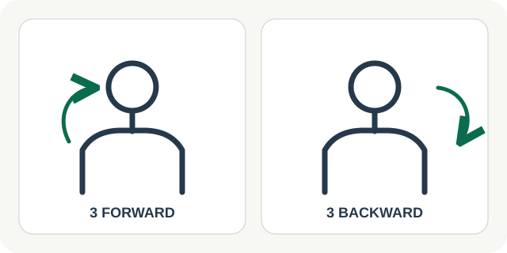

# 01 — Shoulder Rolls

**Роль:** тихое движение за столом. **Длительность практики:** 45–60 секунд. **Статус:** текст и схема для обсуждения.

## Когда показывать

Человек может сделать короткую паузу, но не может встать; руки свободны. Не предлагать во время активного участия во встрече или если человек исключил движение плеч. В офисе карточка остаётся незаметной для коллег.

## Текст интерфейса на английском

- Заголовок: **A small movement at your desk**
- Причина: **You have a short break before your next task.**
- Шаг 1: **Sit comfortably. Roll your shoulders forward three times, slowly.**
- Шаг 2: **Now roll them backward three times. Stay within a comfortable range.**
- Завершение: **You took a short break from sitting still and gently moved your shoulders.**
- Действия: **Start · Pause · Finish · Not now**

## Повторы и частота

Один подход: **3 медленных круга плечами вперёд и 3 назад**. В демо показываем один подход. В течение рабочего дня можно повторить в другой подходящий момент по желанию; обязательной ежедневной нормы нет.

## Схематичная картинка

Крупный силуэт головы и плеч спереди. На первом шаге одна плавная стрелка показывает направление вперёд; на втором она меняет направление. Рядом крупный счётчик `3 forward / 3 backward`. Не показывать вращение головы и не рисовать полные круги шеей. Для доступности: текстовое описание «три медленных круга плечами вперёд, затем три назад».

## Проверенная основа

[Newcastle Hospitals NHS Foundation Trust](https://www.newcastle-hospitals.nhs.uk/services/newcastle-occupational-health-service/information-for-staff/physiotherapy/self-help-leaflets/1-minute-body-check/) предлагает три круга плечами вперёд и три назад как часть короткой рабочей паузы. Не обещаем снятия боли от одного выполнения.
