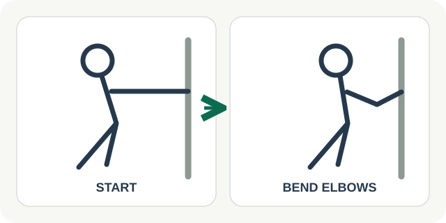

# 02 — Wall Push-ups

**Роль:** короткое силовое движение без пола и оборудования. **Длительность практики:** около 60 секунд. **Статус:** текст и схема для обсуждения.

## Когда показывать

Человек может встать, рядом есть свободная устойчивая стена и ему удобно опираться на руки. Не предлагать при отмеченной боли или ограничении, которому это движение противоречит. Количество повторов не используется как проверка успеха.

## Текст интерфейса на английском

- Заголовок: **A short strength break**
- Причина: **You have room to stand and a moment to move.**
- Шаг 1: **Face a wall. Place your hands on it at about shoulder height.**
- Шаг 2: **Bend your elbows gently to move closer, then push back. Try five at your own pace; you can stop earlier.**
- Завершение: **You stood up and gently used your arms and upper body.**
- Действия: **Start · Pause · Finish · Try something gentler**

## Повторы и частота

Один подход: **5 плавных отжиманий от стены**, с паузой между повторами по желанию. Завершить раньше можно в любой момент. В демо показываем один подход; повторять в течение дня не требуется.

## Схематичная картинка

Вид сбоку: в первом кадре ладони на стене и корпус в прямой удобной линии, во втором локти слегка согнуты и корпус ближе к стене. Две стрелки показывают движение к стене и обратно. Не изображать глубокий наклон или идеальную спортивную форму как обязательную. Текстовое описание дублирует оба положения.

## Проверенная основа

[Mersey Care NHS Foundation Trust](https://www.merseycare.nhs.uk/msk-work/desk-based-jobs) описывает отжимания от стены среди движений для работников за столом. Не обещаем, что одна минута улучшит силу или предотвратит болезнь.
