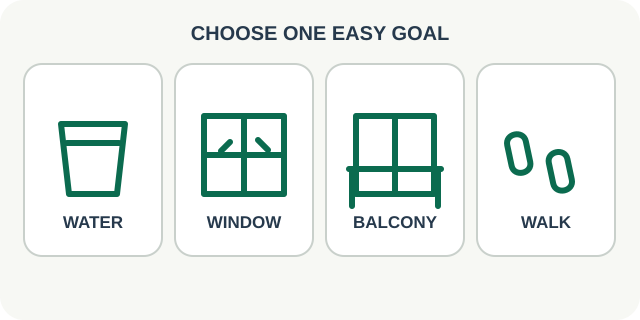

# 03 — Purposeful Walk

**Роль:** отойти от экрана с небольшой целью, без нормы шагов. **Длительность практики:** 3–5 минут или меньше по выбору человека. **Статус:** текст и схема для обсуждения.

## Когда показывать

Есть подходящее окно и человек может отойти от рабочего места. Приложение предлагает только реально доступные варианты: вода, окно с видом вдаль, безопасный доступный балкон или просто несколько шагов. Выбранная цель помогает начать, но не превращается в обязательное задание.

## Текст интерфейса на английском

- Заголовок: **Step away from your screen**
- Вопрос: **What feels easy right now?**
- Варианты: **Get water · Look out the window · Step onto the balcony · Just walk a little**
- После выбора «вода»: **Walk to get water at a comfortable pace.**
- После выбора «окно»: **Walk to the window and look into the distance for a moment.**
- После выбора «балкон»: **Step onto the balcony if it is accessible and comfortable today.**
- После выбора «просто пройтись»: **Take a few easy steps, then return when you are ready.**
- Завершение: **You stepped away from your workstation.** Если человек сам отметил цель, можно назвать её, не выдавая выбор за автоматически измеренный результат.

## Повторы и частота

**Один выход от рабочего места к одной выбранной цели** за карточку. Ориентир — 3–5 минут, но завершить можно раньше. Число шагов не задаём. В другой свободный промежуток прогулку можно повторить по желанию; обязательной частоты нет.

## Схематичная картинка

Сначала четыре крупных простых символа: стакан воды, окно, балкон, следы шагов. После выбора — только стол, выбранная цель и короткая линия маршрута. Не рисовать карту реального помещения и не предполагать, что у каждого есть балкон или дальний вид. Текст каждого варианта виден рядом с символом.

## Проверенная основа

[OSHA](https://www.osha.gov/etools/computer-workstations/work-process) рекомендует короткие паузы и движение во время длительной работы за компьютером. [NHS](https://www.nhs.uk/live-well/exercise/walking-for-health/) рассматривает ходьбу как доступную физическую активность. Не обещаем измеренный эффект от одной короткой прогулки.
