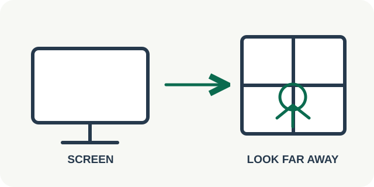

# 04 — Eye Care Break

**Роль:** ежедневная пауза от экрана. **Длительность практики:** 60–90 секунд. **Статус:** текст и схема для обсуждения.

## Когда показывать

Есть уместное окно, и человек может отвести взгляд от экрана. Если предмета вдали нет, предлагаем просто паузу от экрана и не называем её выполнением правила `20–20–20`. Карточка не означает, что приложение измерило усталость глаз.

## Текст интерфейса на английском

- Заголовок: **Give your eyes a short break**
- Причина: **You have a moment away from screen work.**
- Шаг 1: **Look away from the screen. If you can, look at something far away for twenty seconds.**
- Шаг 2: **Blink gently. You may close your eyes briefly if comfortable.**
- Завершение: **You paused screen viewing and gave your eyes a short break.**
- Действия: **Start · Finish · Not now**

## Повторы и частота

За одну карточку: **20 секунд взгляда вдаль**, если он доступен, затем **3–5 обычных мягких морганий**. Закрыть глаза на **5–10 секунд** можно по желанию. Для длительной работы с экраном [Moorfields Eye Hospital](https://www.moorfields.nhs.uk/about-us/news-and-blogs/news/world-sight-day-2023-looking-after-your-eyes-at-work) приводит правило `20–20–20`: примерно каждые 20 минут смотреть 20 секунд вдаль. Одно напоминание в демо — только пример заботы о глазах, а не полное выполнение этого правила; частоту будущих уведомлений выбираем отдельно, чтобы не мешать работе.

## Схематичная картинка

На вводном экране — монитор и удалённый предмет с одной стрелкой перевода взгляда; отдельный знак показывает обычное моргание. Во время самой паузы схема не требует смотреть на экран. Голос может сообщить о завершении, если он включён.

## Проверенная основа

[Moorfields Eye Hospital](https://www.moorfields.nhs.uk/about-us/news-and-blogs/news/world-sight-day-2023-looking-after-your-eyes-at-work) рекомендует регулярно смотреть вдаль при работе с экраном и отмечает, что люди могут моргать реже при длительном экранном внимании. Сильное зажмуривание и упражнения на движение глаз не входят в эту демонстрационную карточку.
