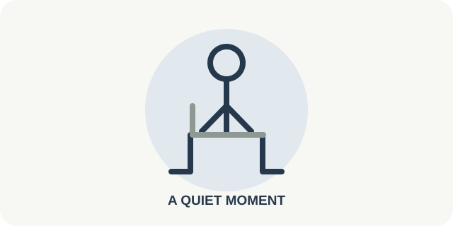

# 05 — Quiet Reset

**Роль:** добровольная медитация, когда человек зол, встревожен или просто не хочет двигаться. **Длительность практики:** около 2 минут. **Статус:** текст и схема для обсуждения; аудиозаписей пока нет.

## Когда показывать

Только после явного выбора **I feel angry or anxious** либо **I need a quiet pause**. Приложение не определяет эмоции по календарю, камере или отказу от движения. Пауза не засчитывается как физическая активность. Если не хочется концентрироваться на дыхании, можно просто почувствовать опору стула и стоп или сразу закончить.

## Текст интерфейса на английском

- Заголовок: **Take a moment before you continue**
- Начало: **Sit comfortably. Keep your eyes open, or close them if you like.**
- Ориентир: **Feel your feet on the floor and the chair supporting you. Notice your natural breathing; there is no need to change it.**
- После тишины: **If your attention wanders, gently return to where you are sitting.**
- Завершение: **You gave yourself a quiet pause before continuing.**
- Действия: **Start · Pause · Finish · Mute**

## Повторы и частота

**Одна спокойная пауза около 2 минут** по запросу человека. Повторять можно тогда, когда самому хочется; ежедневной нормы и счётчика «успешных медитаций» нет. Глаза можно держать открытыми или закрыть; дыхание остаётся обычным, без задержек и обязательного счёта.

## Схематичная картинка

Удобная поза сидя и опора стоп; без изображения «правильной» эмоции и без стрелок, задающих темп дыхания. При закрытых глазах схема не нужна. Контрастный короткий текст остаётся доступен на экране; яркое мигание и обязательная анимация исключены.

## Звуковой сценарий: голос и фон

Перед началом человек выбирает **голос с фоном, только голос, только фон или полную тишину**. Из фонов обсуждаем **Ocean, Rain, Forest, Soft Piano, Warm Ambient, Gentle Strings**. Фон стартует плавно и звучит тише голоса; в любой момент его можно выключить. Голос — один из двух выбранных пользователем, с режимом **Concise** или **Guided**. Ничего не воспроизводится автоматически.

| Момент | Голос Concise | Дополнение Guided |
|---|---|---|
| Начало | “Sit comfortably. You can close your eyes if you like.” | “Feel the chair supporting you and your feet on the floor.” |
| После короткой паузы | “Notice your natural breathing. There is no need to change it.” | “Thoughts may come and go. You do not need to clear your mind.” |
| Середина | Тишина. | Одна мягкая подсказка: “If your attention wanders, gently return to where you are sitting.” |
| Завершение | “Your pause is complete. Take more time if you need.” | Та же реплика. |

Голос не должен заполнять всю паузу. Конкретные записи фона и озвучки будут выбраны отдельно; сейчас это только текст сценария.

## Проверенная основа

[NHS о помощи при злости](https://www.nhs.uk/mental-health/feelings-symptoms-behaviours/feelings-and-symptoms/anger/) предлагает паузу, практику внимания и спокойное дыхание как варианты самопомощи. [NHS о дыхательных практиках](https://www.nhs.uk/mental-health/self-help/guides-tools-and-activities/breathing-exercises-for-stress/) советует не форсировать дыхание. Эта карточка не диагностирует и не лечит тревогу или выгорание и не обещает, что эмоция исчезнет за две минуты.
