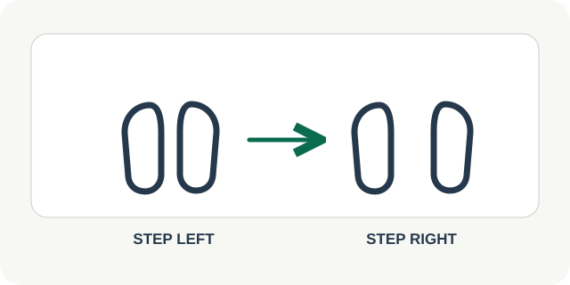

# 06 — Gentle Dance

**Роль:** короткое свободное движение для тех, кому нравится танец. **Длительность практики:** около 90 секунд. **Статус:** текст и схема для обсуждения; музыкальных записей пока нет.

## Когда показывать

Есть место для пары шагов, человек выбрал танец и ему комфортно двигаться на виду. По умолчанию — дома или в уединённом месте. Без прыжков, пола и обязательной хореографии. Если момент не подходит, WorkPulse выбирает `NOT NOW`.

## Текст интерфейса на английском

- Заголовок: **A little movement, your way**
- Причина: **You have a short window and chose a movement you enjoy.**
- Шаг 1: **Start with easy steps side to side.**
- Шаг 2: **Move your arms if you like. Keep a comfortable pace.**
- Шаг 3: **Slow down before you finish.**
- Завершение: **You took a short dance break and moved in a way you chose.**
- Действия: **Start · Pause · Finish · Mute**

## Повторы и частота

**Одна последовательность около 90 секунд:** 15 секунд спокойных шагов из стороны в сторону, около минуты в удобном ритме, 15 секунд постепенного замедления. Количество шагов не задаём. Повторить в другой подходящий момент можно по желанию; ежедневной нормы нет.

## Схематичная картинка

Два положения стоп и одна стрелка переноса веса из стороны в сторону; руки показаны как необязательный элемент. Три этапа крупными словами: **Easy start → Your pace → Slow finish**. Схема не оценивает точность движения и не создаёт ощущения «танцевать правильно».

## Музыка

Предварительные **пять конкретных записей разных жанров**. Каждая ссылка ведёт на страницу записи с указанной автором лицензией **CC BY 4.0**:

| Жанр | Трек | Темп | Источник и лицензия |
| --- | --- | --- | --- |
| Диско | **Electro Cabello** — Kevin MacLeod | 117 BPM | [Запись и CC BY 4.0](https://incompetech.com/music/royalty-free/index.html?isrc=USUAN1400048) |
| Фанк | **Enter the Party** — Kevin MacLeod | 120 BPM | [Запись и CC BY 4.0](https://incompetech.com/music/royalty-free/index.html?isrc=USUAN1100240) |
| Латино | **Verano Sensual** — Kevin MacLeod | 103 BPM | [Запись и CC BY 4.0](https://incompetech.com/music/royalty-free/index.html?isrc=USUAN1900020) |
| Электроника | **Special Spotlight** — Kevin MacLeod | 126 BPM | [Запись и CC BY 4.0](https://incompetech.com/music/royalty-free/index.html?isrc=USUAN1600067) |
| Регги | **Montego** — Kevin MacLeod | 73 BPM | [Запись и CC BY 4.0](https://incompetech.com/music/royalty-free/index.html?isrc=USUAN1100808) |

Это кандидатный список для концепции; **аудиофайлы пока не встроены**. [CC BY 4.0](https://creativecommons.org/licenses/by/4.0/) допускает коммерческое использование и адаптацию при указании автора, ссылки на лицензию и изменений. До включения музыки в продукт сохраняем страницу и условия лицензии для каждой записи и делаем доступный из карточки раздел **Music credits**: название, Kevin MacLeod, ссылка на источник, CC BY 4.0 и отметка о сокращении до 90 секунд, если используем фрагмент. Если нужное указание авторства невозможно обеспечить, выбираем другую запись или отдельную лицензию.

На карточке показываем пять жанров и треков, **Use my playlist** и **No music**. **Use my playlist** означает, что человек запускает свой плейлист в собственном плеере; интеграцию с музыкальным сервисом и её условия проверяем отдельно. Музыка не включается автоматически, а отсутствие музыкального сервиса не мешает выполнить карточку. Выбор сохраняется как предпочтение пользователя, если он этого хочет. Приложение не обещает, что мелодия изменит настроение.

## Проверенная основа

[ВОЗ](https://www.who.int/health-topics/noncommunicable-diseases/physical-activity) включает танец в примеры физической активности. Эта короткая карточка — продуктовый пример, не самостоятельная тренировка и не обещание улучшить настроение.
